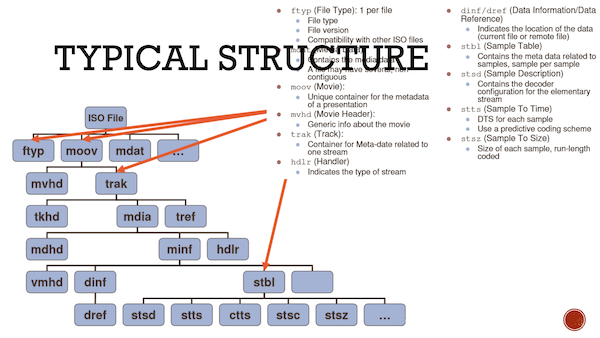

## mp4 篇

> 介绍 MP4 之前需要先了解 ISO Base Media Format,规范见(iso 14496-12 即 MPEG-4 part 12),mp4 格式是在 iso bmff 基础上进行扩展,MP4 规范文档参见 (iso 14496 -14).

> iso bmff 为基于时间的多媒体文件(音频、视频) 定义了一种通用的结构, iso bmff 直接基于苹果的 QuickTime 容器格式设计. bmff 的设计特点是`扩展性好`,`以 BOX 为封装单位,一个 BOX 承载一部分特定的数据,各 BOX 之间相互独立, BOX 内也可以承载其他BOX`

> mp4 格式就是在 bmff 基础上新增一些 BOX,来表示 MPEG-4 音视频 codec 信息、object descriptors、scene descriptions 等

[iso 14496-12](https://www.iso.org/standard/68960.html)

[iso 14496-14](https://www.iso.org/standard/38538.html)

**bmff 及其衍生 格式**


### BOX

box 基本结构: [4 字节 size][4 字节 type][size - 8 字节 payload]

```
aligned(8) class Box (unsigned int(32) boxtype, optional unsigned int(8)[16]extended_type) {
  unsigned int(32) size;
  unsigned int(32) type = boxtype;
  if (size==1) {
    unsigned int(64) largesize;
  } else if (size==0) {
    // box extends to end of file
  }
  if (boxtype==‘uuid’) {
    unsigned int(8)[16] usertype = extended_type;
  }
}

如果size === 1,真实的 size 存储在第9字节开始,占8字节
如果size === 0, 表示这个box是整个文件中的最后一个 box,剩下的字节全部属于这个box，一般就是 mdat box
type 指定box 类型,ftyp  moov mdat 等

```

**box 一览**




- moov

metadata box,提供了 音视频编解码器、采样、音视频元数据等信息,十分重要, 在通过 MSE 操作 buffer 时,moov 的数据要首先 append, 对 fragment mp4，这部分信息保存在 init.mp4 中

- trak 路径: moov -> trak

音轨、视轨、字幕 相关元信息

- tkhd 路径: trak -> tkhd

可解析出视频宽高信息

- stbl 路径: moov -> trak -> mdia -> minf -> stbl

Sample Table Box: 包含时间和数据的索引信息，容器 box


> 对于支持 range 请求的 server,通过浏览器直接播放 mp4 时,我们可以 seek,seek 时,浏览器自动发 206 请求,并且请求 header 中携带 Range 参数,指定 seek 点的数据在整个文件的偏移,浏览器是如何做到这一点的呢? 就是通过 mp4 的 stbl 下的 stsc stco 等 从 timeline 对应时间找到采样,在找到具体采样数据在 file 中位置,做到 time/space 映射。

- stsd 路径 stbl -> stsd

Sample Description Box: 包含音视频编码器信息,例如 `对 h264 编码视频的 avc1 box,对 aac 编码音频的 mp4a box`

**fragment mp4**

fragment mp4 即分片的 mp4,每个 fmp4 包含自己单独的采样信息(moof box)和采样数据,moov box 存放在单独的 init.mp4 中 (一般 moov 中`重点包括各track包含的media信息的解码器信息,stsd`,其他采样信息存在在各 fmp4 的 moof 中)

- moof

```

moof
  mfhd // 包含sequence number 代表此fmp4在整个列表(例如 hls m3u8列表)的索引
  traf
    tfhd  // 提供采样的默认信息
    tfdt  // `包含重要的baseMediaDecodeTime属性` 代表当前fmp4分片应该在timeline什么位置开始播放
    trun  // 重要的, 包含此分片所有采样元信息

```

采样的具体信息:

1. size: 采样数据大小
2. duration: 采样播放时间
3. compositionTimeOffset: 合成时间,采样从被解码到播放的时间差
4. sample_flags 字段: 采样间的依赖关系

sample_flags:

```
bit(4) reserved=0;
unsigned int(2) is_leading;
unsigned int(2) sample_depends_on;
unsigned int(2) sample_is_depended_on;
unsigned int(2) sample_has_redundancy;
bit(3) sample_padding_value;
bit(1) sample_is_non_sync_sample;
unsigned int(16) sample_degradation_priority;

```


**h264 aac box**

- avc1 box 路径: moov -> trak -> mdia -> minf -> stbl -> avc1

```

avc1 box
  avcC box 属性
    level
    profile
    sps
    pps
    profileComptibility

```

- mp4a box 路径: moov -> trak -> mdia -> minf -> stbl -> mp4a

```
  mp4a box 属性
    channels
    sample_rate
    ests box 属性
      codec
      stream_type
      config(由 audioObjectType、samplerateIndex、extensionSamplingIndex 组成的两字节 或四字节)

```

ISO BMFF 中对 encrypted 的支持,见[drm 篇](./drm.md)
